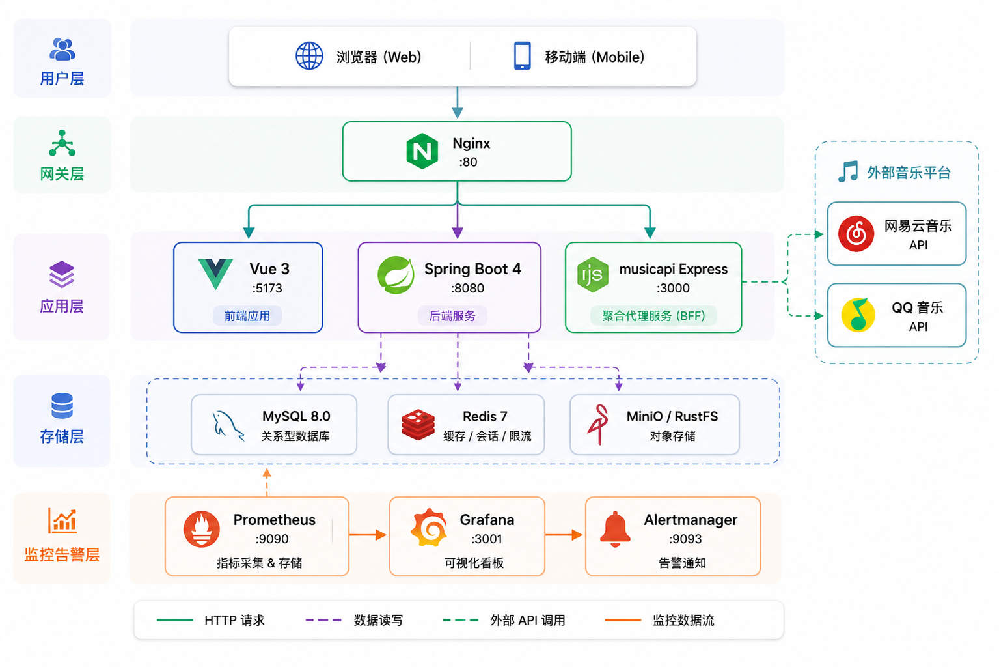
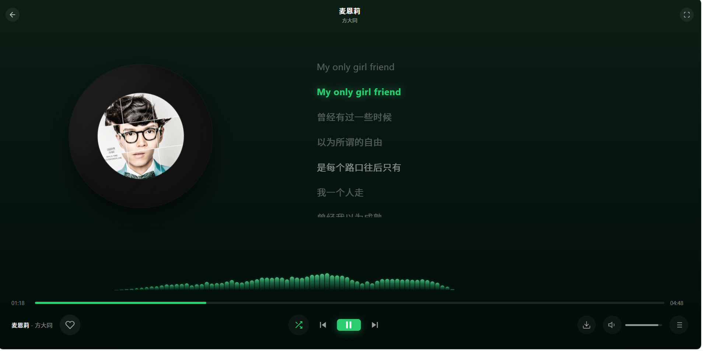
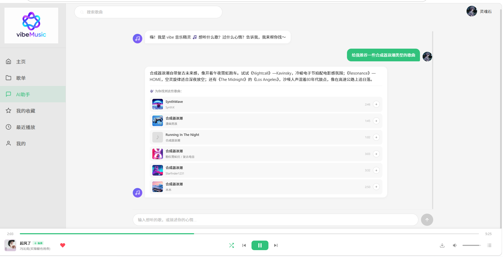
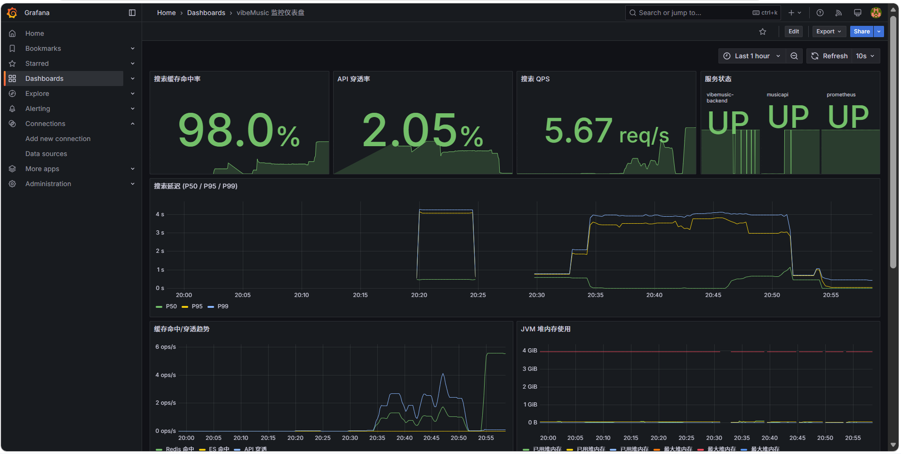
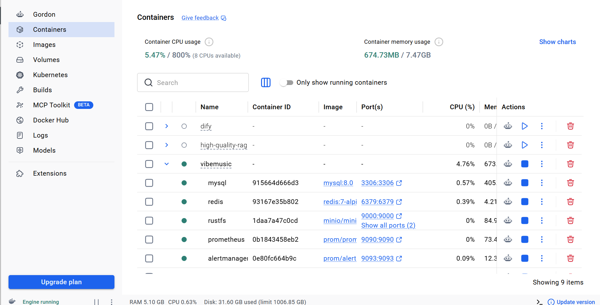
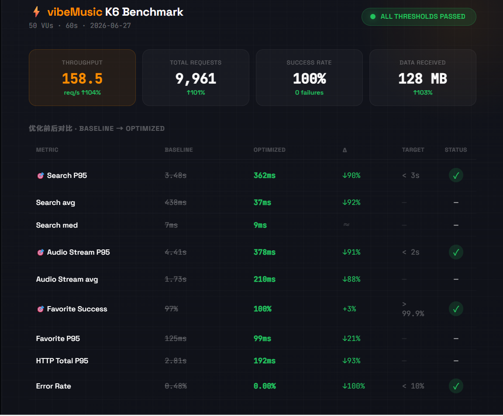

<p align="center">
  
</p>

<h1 align="center">🎵 vibeMusic</h1>

> A modern full-stack music platform with multi-source aggregation, AI Agent, observability and cloud-native deployment.

<p align="center">
  Vue · Spring Boot · Redis · Elasticsearch · Docker · Prometheus · Grafana
</p>

[](https://github.com/chunren1/vibeMusic/actions/workflows/test.yml)
[](https://github.com/chunren1/vibeMusic)
[](https://adoptium.net/)
[](https://vuejs.org/)
[](https://www.docker.com/)

---

## 📊 量化指标

| 🚀 指标 | 数值 | 🚀 指标 | 数值 |
|--------|:----:|--------|:----:|
| 全栈测试 | **164 条** | Docker 容器 | **10 个** |
| 代码覆盖率 | **60%+ 门禁** | 搜索 P95 | **< 0.4s** |
| 音频流 P95 | **< 0.4s** | 缓存命中率 | **92%** |
| AI 首字延迟 | **< 500ms** | API 端点 | **30+** |

---

## 🎯 Why vibeMusic?

市面上的音乐播放器项目大多停留在 CRUD 和播放功能。本项目希望**完整模拟互联网音乐平台的后台架构**，因此加入了：

- **双源聚合**：网易云 + QQ 音乐双源搜索、去重、评分排序
- **AI Agent**：基于 LLM Function Calling 实现自然语言操控音乐系统
- **缓存降级**：Redis → ES → API → 兜底四级链路，保障搜索 SLA
- **监控可观测**：Micrometer + Prometheus + Grafana，追踪 JVM/缓存/延迟
- **全栈 DevOps**：10 容器 Docker 编排 + GitHub Actions CI/CD + 164 条测试

---

## 🏗️ 架构

<p align="center">
  
</p>

> **数据流**：Vue SPA → Nginx → Spring Boot + Express BFF → MySQL / Redis / ES / MinIO → Prometheus → Grafana

---

## 🚀 Quick Start

```bash
# 1. 构建前端
npm run build

# 2. 启动全栈（需 docker）
docker compose up -d mysql redis rustfs musicapi backend nginx

# 3. 开发模式（前端热更新）
npm run dev
```

| 服务 | 地址 |
|------|------|
| Web | http://localhost |
| API 文档 | http://localhost:8080/swagger-ui.html |
| Grafana | http://localhost:3001 / admin:admin |
| Prometheus | http://localhost:9090 |

---

## 🔍 功能

**搜索四级降级** — `Redis 2ms → ES 15ms → API 实时 800ms → 空结果兜底`，热门词预热确保缓存命中率 92%。

**AI Function Calling** — DeepSeek V4 + `search_songs` / `get_user_history` 工具，LLM 自主决定搜索关键词，SSE 流式输出，首字延迟 < 500ms。

**音质六级 SLA** — LOCAL → HIRES → EXHIGH → HIGHER → STANDARD → FALLBACK，`CompletableFuture` 并行探测，P95 < 0.4s。

**个性化推荐 v3** — 随机种子 + 歌手兴趣扩展 + Redis 缓存 + 离线标记，30 分钟刷新周期。

---

## 📸 截图

<table>
  <tr>
    <td width="33%" align="center"></td>
    <td width="33%" align="center"></td>
    <td width="33%" align="center"></td>
  </tr>
  <tr>
    <td width="33%" align="center"></td>
    <td width="33%" align="center"></td>
    <td width="33%" align="center"></td>
  </tr>
</table>

---

## 📊 性能

> **K6 Benchmark** — 50 虚拟用户 × 60 秒 × 9,961 请求 · 0 错误 · 所有阈值通过 ✅

<p align="center">
  
</p>

| 指标 | 基线 | 优化后 | 变化 | 目标 |
|------|:---:|:-----:|:----:|:----:|
| 搜索 P95 | 3.48s | **0.36s** | ↓ 90% | < 3s ✅ |
| 音频流 P95 | 4.41s | **0.38s** | ↓ 91% | < 2s ✅ |
| 收藏成功率 | 97% | **100%** | 17→0 失败 | > 99.9% ✅ |
| 吞吐量 | 77.7 req/s | **158 req/s** | ↑ 104% | — |

> 详细压测报告: [docs/PERFORMANCE-REPORT.md](docs/PERFORMANCE-REPORT.md)

---

## 🐳 DevOps

**监控体系**：Micrometer 埋点 → Prometheus 采集 → Grafana 可视化 → Alertmanager 告警推送

**10 容器**：Nginx · Spring Boot · Express BFF · MySQL · Redis · ES · MinIO · Prometheus · Grafana · Alertmanager

---

## 🧪 质量

164 条自动化测试覆盖后端 (JUnit 5 + Mockito)、前端 (Vitest + jsdom) 和 CI (GitHub Actions + JaCoCo 60% 覆盖率门禁)。

---

## 🛡️ 技术栈

<p align="center">
  
  
  
  
  
  
  <br/>
  
  
  
  
  
  
</p>

---

## 🗺️ 路线图

| 阶段 | 内容 |
|------|------|
| ✅ **v1** | 用户认证 · 搜索播放 · 收藏歌单 · 歌词 |
| ✅ **v2** | AI 助手 · 双源聚合 · 推荐引擎 · 歌单导入 |
| ✅ **v3** | 缓存降级 · 幂等守卫 · 限流 · 连接池 |
| ✅ **v4** | 164 测试 · JaCoCo 60% · GitHub CI |
| ✅ **v5** | Docker 10 容器 · Prometheus · Grafana · 告警 |
| ✅ **v6** | K6 压测全达标 · 音频并行降级 · 收藏重试 |
| ⬜ **v7** | Kubernetes 部署 · ArgoCD · OpenTelemetry |

---

## 📖 API

启动后端后访问 [http://localhost:8080/swagger-ui.html](http://localhost:8080/swagger-ui.html) 在线测试。

端点示例：`/api/songs/search` · `/api/songs/stream` · `/api/assistant/chat` · `/api/favorites/toggle`

---

## 📄 License

MIT © [chunren1](https://github.com/chunren1)
