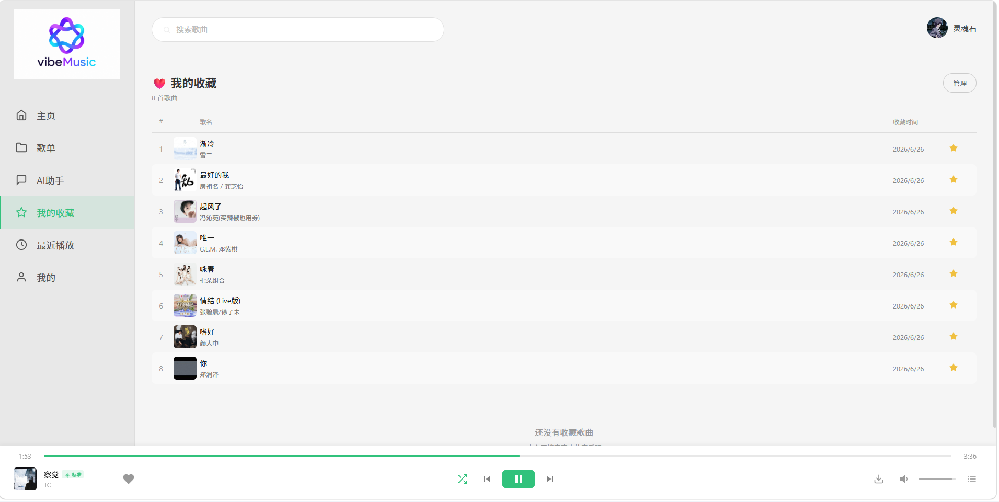
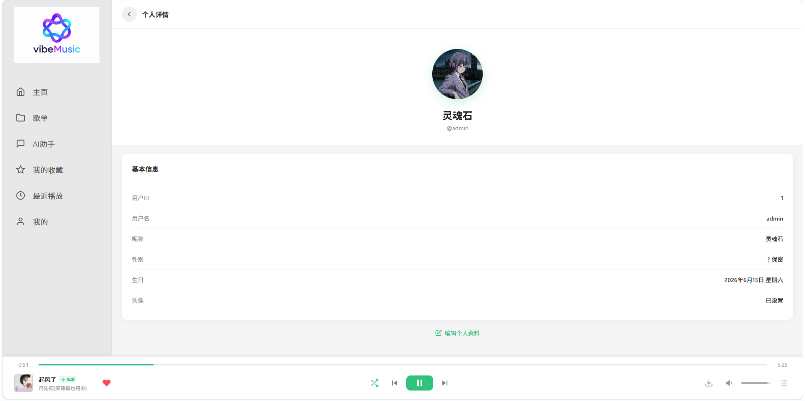

# 🎵 vibeMusic

> **全栈音乐平台** — 网易云 + QQ 音乐双源聚合，自建搜索/推荐/缓存体系，完整 DevOps 工具链。
> 覆盖 Java Spring Boot、Vue 3、Redis、Elasticsearch、Docker 全技术栈，83 条自动化测试。

[](https://github.com/green-leavesQAQ/vibeMusic/actions/workflows/test.yml)
[](https://github.com/green-leavesQAQ/vibeMusic)
[](https://github.com/green-leavesQAQ/vibeMusic)
[](https://adoptium.net/)
[](https://adoptium.net/)
[](https://spring.io/projects/spring-boot)
[](https://vuejs.org/)
[](https://www.docker.com/)
[](LICENSE)

## ✨ 技术亮点

| 类别 | 亮点 |
|------|------|
| 🏗️ 架构 | 7 容器 Docker 编排，Nginx 统一入口，前后端分离 + BFF 网关 |
| ⚡ 性能 | 三级缓存 (Redis → ES → API)，HTTP 连接池复用，I/O 事务拆分 |
| 🛡️ 可靠性 | 4 策略搜索降级链，8 级指数退避重试，缓存污染自动清理 |
| 🧪 质量 | 83 条自动化测试，GitHub Actions CI/CD，JaCoCo 覆盖率报告 |
| 🔍 搜索 | Elasticsearch 8.18 + IK 分词 + 高亮 + 平台聚合统计 |
| 🎯 推荐 | 播放历史歌手权重聚合 + Redis 分层缓存 + RustFS 离线优先 |
| 🤖 AI | DeepSeek V4 音乐助手，意图识别 + 智能关键词提取 + 限流 |
| 📱 多端 | Vue 3 桌面端 + 移动端独立 UI + Capacitor Android APK |
| 🔐 安全 | JWT httpOnly Cookie，BCrypt 加密，幂等防护，输入校验 |
| 🎵 音质 | 六级 SLA (LOCAL→HIRES→EXHIGH→HIGHER→STANDARD→FALLBACK) 逐级降级 |
| 📦 运维 | Docker 一键部署，K6 压力测试，数据库备份，Sentry 错误监控 |
| 📖 API 文档 | Knife4j OpenAPI 3.0 → `http://localhost:8080/doc.html` |

## 📸 项目演示

| 首页 | 推荐+歌单 | 搜索 |
|------|----------|------|
|  |  |  |

| 播放器 | 歌单管理 | 最近播放 |
|--------|---------|---------|
|  |  |  |

## 技术架构

```
┌──────────────────────────────────────────────┐
│         Nginx (port 80) 统一入口              │
│   静态文件 serve + API 反向代理 + SPA fallback │
└──────────────────────┬───────────────────────┘
                       │
          ┌────────────┴────────────┐
          ▼                         ▼
┌──────────────────┐    ┌──────────────────────────┐
│  Vue 3 + Vite     │    │  Spring Boot 4 + Java 17  │
│  构建产物 (dist/)  │    │  MyBatis-Plus + JWT       │
│  + Capacitor APK  │    │  (localhost:8080)         │
└──────────────────┘    └──────────┬───────────────┘
                                   │
                     ┌─────────────┴─────────────┐
                     ▼                           ▼
            ┌─────────────────┐        ┌────────────────────────┐
            │    musicapi      │        │  MySQL + Redis + ES    │
            │  Express.js 网关  │        │  数据持久化 + 三级缓存  │
            │  (localhost:3000)│        │  ES:9201 IK 分词搜索   │
            │ 网易云 + QQ音乐   │        └────────────────────────┘
            │ Cookie 统一管理   │
            └─────────────────┘
```


## 快速开始

### 环境要求

- Java 17+ / Node.js 20+ / Docker Desktop

### 1. 安装依赖

```bash
npm install              # 安装 concurrently（工作区编排）
npm run install:all      # 安装 musicapi + 前端全部依赖
```

### 2. 启动中间件

```bash
npm run docker:dev        # 开发模式：仅起中间件 (MySQL + Redis + ES + MinIO + Nginx)
# MinIO 管理: http://localhost:9001 (rustfsadmin/rustfsadmin)
# 数据库自动初始化，默认管理员: admin / 123456
```

### 3. 启动后端

```bash
cd vibeMusic-backend
mvn spring-boot:run       # → http://localhost:8080
# API 文档: http://localhost:8080/doc.html
```

### 4. 启动前端

```bash
npm run dev               # concurrently 同时启动 musicapi(3000) + 前端(5173)
```

### 生产部署

```bash
npm run build             # 构建前端到 dist/
npm run docker:up         # 启动所有 Docker 服务（含 Nginx 80 端口）
# 访问 http://localhost 即进入生产模式
```

## 📖 API 文档

启动后端后访问 Knife4j 文档页面，可直接在浏览器中测试所有接口：

> **[http://localhost:8080/doc.html](http://localhost:8080/doc.html)**

 *(即将添加截图)*

### 核心端点

| 模块 | 端点 | 说明 |
|------|------|------|
| Auth | `/api/auth/register` `login` `me` `logout` `change-password` | 注册/登录/JWT认证 |
| Songs | `/api/songs/search` `play` `stream` `lyric` `random` `banner` `history` | 搜索/播放/歌词/推荐 |
| Recommend | `/api/recommend/personalized` | 个性化推荐引擎 |
| Favorites | `/api/favorites/toggle` `list` `ids` `remove-batch` | 收藏管理 |
| Playlists | `/api/playlists/list` `create` `songs` `add-song` `remove-song` `delete` | 歌单 CRUD |
| Download | `/api/download/{sourceId}` `check/{sourceId}` `file/{sourceId}` | RustFS 离线缓存 |
| AI | `/api/assistant/chat` | DeepSeek V4 音乐助手 |
| Monitor | `/api/monitor/cache-stats` `/api/songs/es-health` | 监控端点 |

完整端点列表 + 在线测试集合 → [Postman Collection](docs/vibeMusic.postman_collection.json)

## 🧪 测试体系

```
全链路 83 条测试
├── 后端 42 条 (JUnit 5 + MockMvc + H2 内存数据库)
│   ├── Service 单元测试  25 条  注册/登录/收藏/播放/清理
│   └── Controller 集成测试 15 条  认证/搜索/播放/流/歌词
├── 前端 41 条 (Vitest + jsdom)
│   ├── PlayerStore Test  21 条  队列操作/切歌/模式/持久化
│   └── PlayerBar Test    20 条  渲染/面板/控制/音量
└── CI 自动化 (GitHub Actions)
    └── push/PR → 后端 + 前端自动跑，上传覆盖率报告
```

```bash
npm test                    # 全部测试
npm run test:backend        # 仅后端 (mvn test)
npm run test:frontend       # 仅前端 (vitest run)
```

覆盖率报告：`vibeMusic-backend/target/site/jacoco/index.html`

## 🐳 运维体系

### 常用命令

| 命令 | 功能 |
|------|------|
| `npm run dev` | 并发启动 musicapi + 前端 |
| `npm run docker:up` | 全栈生产部署 |
| `npm run docker:dev` | 仅启动基础设施 |
| `npm test` | 全量测试 (83 条) |
| `npm run health` | 容器健康检查 |
| `npm run backup:db` | 数据库备份 (mysqldump + gzip) |
| `npm run ops` | 跨平台运维面板 |
| `k6 run scripts/k6-test.js` | 压力测试 (50 VU 并发) |
| `python scripts/health_check.py` | Python 健康检查脚本 |

### CI/CD

| 流水线 | 触发条件 | 流程 |
|--------|----------|------|
| `test.yml` | push/PR → main | 后端 JUnit + 前端 Vitest → 上传测试 & 覆盖率报告 |
| `deploy.yml` | 手动触发 / 推送 tag(v*) | 构建 JAR + dist → Docker 镜像 → 部署 → 健康检查 |

### 备份恢复

```bash
npm run backup:db           # → docker-data/backups/vibemusic_YYYYMMDD_HHmmss.sql.gz
# 恢复
gunzip vibemusic_*.sql.gz
docker exec -i vibemusic-mysql mysql -uroot -p123456 vibemusic < vibemusic_*.sql
```

## 📸 项目截图

> 截图即将添加 → [docs/screenshots/](docs/screenshots/)

| 桌面端 | 移动端 |
|--------|--------|
| *(搜索页截图)* | *(移动搜索截图)* |
| *(播放器截图)* | *(移动播放截图)* |

## 🤖 AI 工程化

本项目内置完整的 AI 开发规范，支持 Claude Code 和 CodeBuddy 双工具：

| 文件 | 用途 |
|------|------|
| `CLAUDE.md` | Claude Code 规则（TDD 铁律 + 安全约束 + 工作流） |
| `AI-GUIDE.md` | 非技术用户使用指南 |
| `.claude/commands/` | 自定义命令：`/plan`（规划）、`/audit-time`（时间审计） |
| `.codebuddy/` | CodeBuddy Agent + Rules + Skills |

## 📂 项目结构

```
vibeMusic/
├── vibemusic-web/            # Vue 3 前端 (5173)
├── vibeMusic-backend/        # Spring Boot 后端 (8080)
├── musicapi/                 # Express BFF 网关 (3000)
├── docker-compose.yml        # 7 容器编排
├── nginx/nginx.conf          # Nginx 统一入口
├── scripts/                  # 运维脚本 (Python + K6)
├── docs/                     # 文档 & Postman Collection
├── CHANGELOG.md              # 详细迭代记录
├── NOTICE.md                 # 法律声明
└── .github/workflows/        # CI/CD 流水线
```

## 📝 迭代记录

详细的优化历史和技术决策见 **[CHANGELOG.md](CHANGELOG.md)**，涵盖 5 轮迭代超过 100 项改进。

## 已知问题

- QQ 搜索需 `t:0` 参数指定单曲类型
- `MyBatisPlusConfig` 自定义 SqlSessionFactory 需显式注入 MetaObjectHandler

## License

MIT
