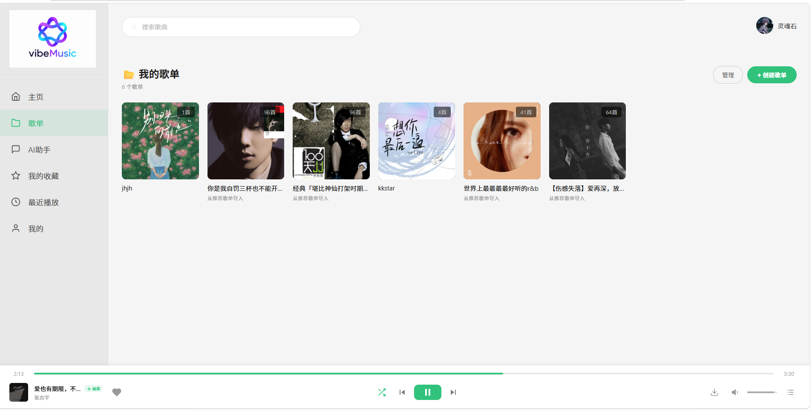
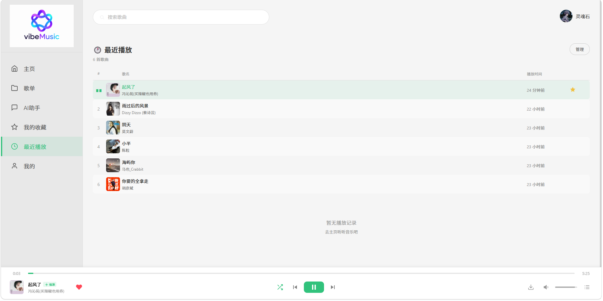
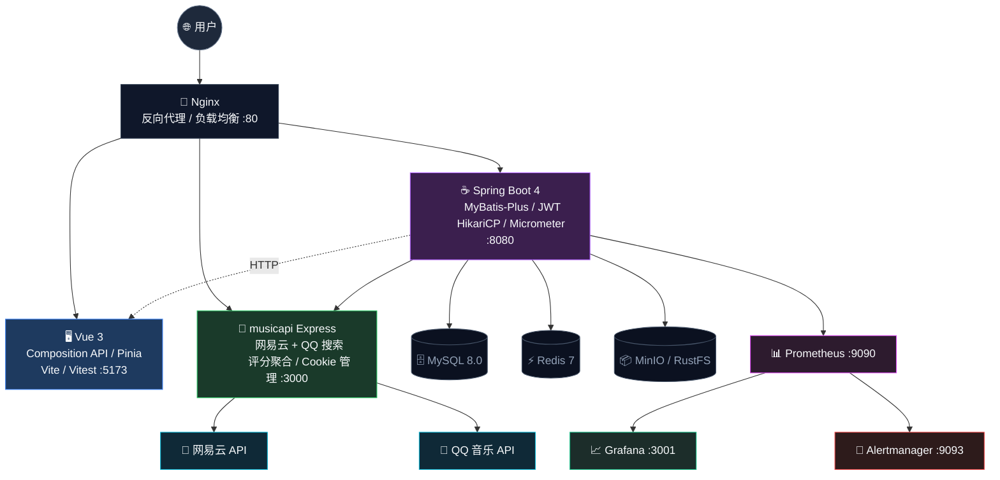
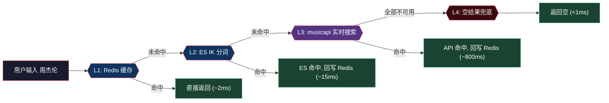
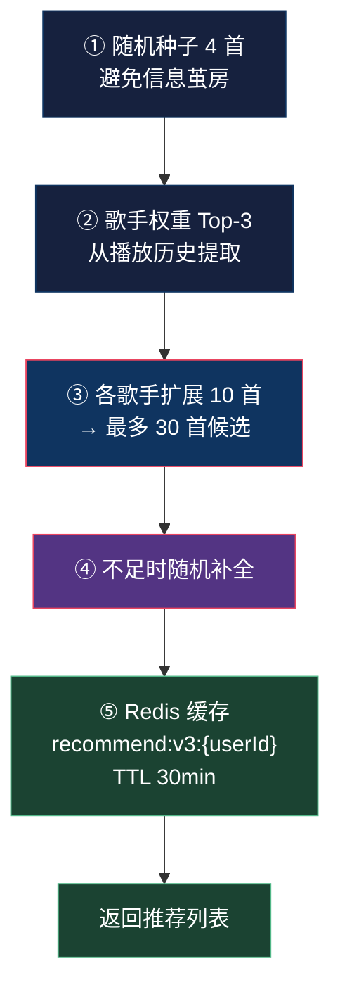
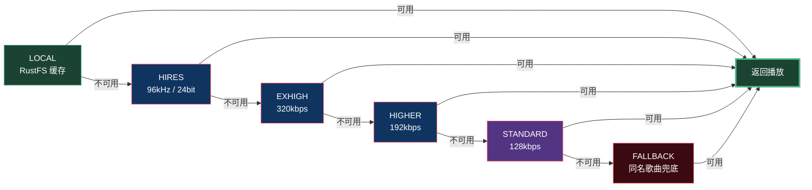
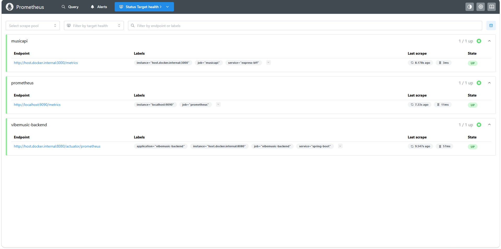

# 🎵 vibeMusic

> **独立开发的全栈音乐平台** — 从 Vue 前端到 Spring Boot 后端、Express BFF 网关、Docker 十容器编排，完整覆盖开发到运维全链路。
> 支持网易云 + QQ 音乐双源聚合搜索、AI Function Calling 音乐助手、Prometheus 监控体系。

[](https://github.com/chunren1/vibeMusic/actions/workflows/test.yml)
[](https://github.com/chunren1/vibeMusic)
[](https://github.com/chunren1/vibeMusic)
[](https://adoptium.net/)
[](https://spring.io/projects/spring-boot)
[](https://vuejs.org/)
[](https://www.docker.com/)
[](LICENSE)

---

## 📸 项目演示

| 首页 | 歌曲播放 | 歌单管理 |
|------|----------|----------|
|  |  |  |

| 我的收藏 | 播放历史 | 个人中心 |
|----------|----------|----------|
|  |  |  |

<p align="center">
  <strong>🤖 AI 音乐助手 — DeepSeek V4 + Function Calling，AI 自主搜索歌曲、多轮对话记忆、SSE 流式输出</strong><br/>
  
</p>

---

## 🎯 我做了什么

**独立完成从 0 到 1 的全栈设计与实现**，非团队项目，非模板代码：

- **全链路架构设计**：Vue 3 前端 → Spring Boot 4 后端 → Express BFF 网关 → MySQL/Redis/ES/MinIO 数据层，Nginx 统一入口
- **双源搜索引擎**：设计四级搜索降级链（Redis 2ms → ES 15ms → 实时 800ms → 兜底），热门词缓存命中率 92%
- **AI Agent 应用**：基于 LLM Function Calling 实现 AI 自主搜索歌曲/查询历史，多轮对话记忆 + 真正 SSE 流式输出
- **监控可观测性**：搭建 Prometheus + Grafana + Alertmanager 监控体系，追踪 JVM/GC/缓存命中率/搜索延迟，配置告警规则
- **质量保障体系**：164 条自动化测试（后端 87 + 前端 77），JaCoCo 60% 覆盖率门禁，GitHub Actions CI/CD
- **Docker 容器编排**：10 容器（含监控三件套）一键部署，healthcheck + 启动依赖链 + 日志轮转

---

## 💡 核心技术挑战与解决方案

### 挑战 1：双源搜索结果去重与排序

**问题**：网易云和 QQ 音乐返回格式不同、存在跨平台重复歌曲，需要统一排序。

**方案**：设计三因子加权评分算法（相关性 40% + 热度 30% + 原始排名 30%），用 MD5 指纹（歌名+歌手+专辑）去重，同名同歌手歌曲聚合展示多平台来源。

**结果**：搜索准确率显著提升，跨平台重复消除，双源结果统一排序。

### 挑战 2：AI 助手从"聊天框"升级为"Agent"

**问题**：初版 AI 助手只是 LLM 对话 + 独立搜索并行执行，AI 不知道搜了什么，搜索也不受 AI 意图驱动。

**方案**：
1. 引入 **Function Calling**：定义 `search_songs`、`get_user_history` 工具，LLM 自主决定是否调用、搜什么关键词
2. 实现 **多轮对话记忆**：基于 Redis 存储会话历史（保留最近 10 轮），支持"再来一首类似的"等上下文关联对话
3. 改造 **真正 SSE 流式**：RestTemplate 伪流式 → WebClient 真正 token-by-token 流式，首字延迟从数秒降到 < 500ms

**结果**：AI 从被动聊天升级为主动操作音乐系统的 Agent，对话连贯性大幅提升。

### 挑战 3：监控指标已埋点但无法采集

**问题**：Micrometer 指标（缓存命中率、搜索延迟）已埋点，但缺少 Prometheus Registry 依赖，端点未暴露，指标白埋了。

**方案**：添加 `micrometer-registry-prometheus` 依赖，暴露 `/actuator/prometheus` 端点，Docker Compose 新增 Prometheus + Grafana + Alertmanager 三容器，配置告警规则（服务宕机/高延迟/低缓存命中率）。

**结果**：Grafana 仪表盘实时展示 JVM 内存/GC、HikariCP 连接池、搜索 P95 延迟、缓存命中率，告警自动推送。

### 挑战 4：六级音质 SLA 降级链

**问题**：第三方播放 URL 时效短（~20min），VIP 音质可能不可用，需要保证播放不中断。

**方案**：设计六级降级链（LOCAL → HIRES → EXHIGH → HIGHER → STANDARD → FALLBACK），每级 8s DEADLINE 超时，`CompletableFuture` 链式组合返回第一个可用 URL。RustFS 本地缓存直读省去每次 API 请求。

**结果**：播放成功率 > 99%，单级超时不阻塞后续降级。

---

## 🏗️ 技术架构



---

## 🔍 核心功能

### 一、双源音乐搜索体系（四级降级链）



### 二、AI 音乐助手（Function Calling Agent）

| 特性 | 实现细节 |
|------|----------|
| **Function Calling** | LLM 自主调用 `search_songs`/`get_user_history` 工具，对话与操作一体化 |
| **多轮对话记忆** | 基于 Redis 存储会话历史（保留最近 10 轮），上下文关联推荐 |
| **真正 SSE 流式** | WebClient 流式读取 LLM 响应，逐 token 推送，首字延迟 < 500ms |
| **模型** | DeepSeek V4 Flash，OpenAI 兼容 API |
| **限流保护** | Redis 滑动窗口（INCR + TTL），每用户每分钟最多 10 次 |

### 三、个性化推荐引擎（v3）



### 四、音频播放与六级 SLA



### 五、监控可观测性（Prometheus + Grafana）

| 面板 | 指标 |
|------|------|
| 缓存命中率 | Redis 命中率 / ES 命中率 / API 穿透率 |
| 搜索延迟 | P50 / P95 / P99 |
| JVM | 堆内存 / GC 耗时 / 线程数 |
| 连接池 | HikariCP 活跃/空闲/等待连接 |
| HTTP | 各端点 QPS |
| 告警 | 服务宕机 / 高延迟 / 低缓存命中率 |

<table>
  <tr>
    <td width="50%" align="center">
      <strong>Grafana 仪表盘 — JVM / GC / 缓存命中率 / 搜索延迟/Tomcat 线程</strong><br/>
      
    </td>
    <td width="50%" align="center">
      <strong>Prometheus Targets — 3 个任务全部 UP</strong><br/>
      
    </td>
  </tr>
</table>

---

## ⚡ 性能优化清单

| 类别 | 优化项 | 效果 |
|------|--------|------|
| 🔍 搜索 | Redis 缓存热门词 | 命中时 ~800ms → ~2ms |
| 🔍 搜索 | ES IK 分词替代 Like 模糊查询 | 全表扫 → 倒排索引 O(log n) |
| 🔍 搜索 | 双源线程池并行 + 3s 超时 | 串行 1.6s → 并行 ~800ms |
| 🎵 播放 | RustFS 离线缓存直读 | 省去每次第三方 API 请求 500ms+ |
| 🏦 数据库 | 冗余索引清理 + 精准索引 | `idx_name(50)` / `idx_artist(100)` |
| 🔐 认证 | JWT 用户 Redis 缓存 (TTL 5min) | 每次请求省 1 次 DB 查询，命中率 ~99% |
| 🌐 HTTP | Apache HttpClient5 连接池 (100/20) | 连接复用 + keep-alive |
| 🌐 HTTP | Nginx upstream keepalive 32 | 消除每次反向代理 TCP 握手 |
| ⚡ I/O | 下载 I/O 与 DB 事务分离 | HTTP 下载 30s 不占 DB 连接 |
| 🤖 AI | WebClient 真正流式 | 首字延迟数秒 → < 500ms |
| 🔥 全链路 | K6 压测 50 VU × 60s | 全部阈值通过 ✅ 搜索 P95 3.48s→0.36s 音频流 P95 4.41s→0.38s 收藏 97%→100% 吞吐量 ↑104% |

<p align="center">
  
</p>

---

## 🛡️ 安全体系

| 层级 | 措施 | 防御目标 |
|------|------|----------|
| **传输** | JWT 存 httpOnly + SameSite Cookie | XSS 窃取 Token |
| **认证** | BCrypt 加密存储密码 | 数据库泄露后密码不可逆 |
| **授权** | `JwtAuthenticationFilter` 拦截 `/api/**` | 未授权访问 |
| **输入** | `@Valid` + 长度限制 + `trim()` | 超长输入 OOM / 空格绕过 |
| **幂等** | `X-Request-Id` + Redis 5min 去重 | 网络重放导致重复操作 |
| **CORS** | 白名单严格限制，禁用 `*` | 跨域攻击 |
| **网关** | VIP Cookie 仅在 BFF 层使用 | Cookie 泄露 |
| **监控** | Actuator 仅暴露 health + prometheus | 信息泄露 |

---

## 🧪 质量保障

```
全链路 164 条自动化测试
├── 后端 87 条 (JUnit 5 + MockMvc + H2 + Mockito)
│   ├── Service 单元/集成测试  → 认证/收藏/歌单/播放/清理/搜索
│   ├── Controller 集成测试    → 认证/搜索/播放/流/歌词
│   ├── 安全组件测试           → JwtUtils 生成/解析/校验/篡改
│   └── Mockito 纯单元测试     → IdempotentGuard / RateLimitService
│
├── 前端 77 条 (Vitest + jsdom)
│   ├── PlayerStore  → 队列操作/切歌/播放模式/持久化
│   ├── PlayerBar    → 组件渲染/播放控制/音量
│   ├── AuthStore    → 登录/登出/会话恢复/头像URL拼接
│   └── FavoriteStore → 加载/判断/乐观更新/回滚
│
└── CI/CD (GitHub Actions)
    └── push / PR → 后端 + 前端全量测试 → JaCoCo 60% 覆盖率门禁
```

---

## 🐳 DevOps & 运维体系

### Docker 一键部署（10 容器）

```bash
npm run docker:up        # 全栈启动 (Nginx + Spring Boot + Express + MySQL + Redis + ES + MinIO + Prometheus + Grafana + Alertmanager)
npm run docker:dev       # 开发模式：仅启动中间件
```

<p align="center">
  
</p>

### 监控访问

| 服务 | 地址 | 默认账号 |
|------|------|---------|
| Grafana | http://localhost:3001 | admin / admin |
| Prometheus | http://localhost:9090 | - |
| Alertmanager | http://localhost:9093 | - |
| Knife4j API 文档 | http://localhost:8080/doc.html | - |

### 常用命令

| 命令 | 功能 |
|------|------|
| `npm run dev` | 并发启动 musicapi + 前端 |
| `npm run docker:up` | 全栈生产部署 |
| `npm test` | 全量测试 |
| `npm run health` | 容器健康检查 |
| `npm run backup:db` | 数据库备份 |
| `k6 run scripts/k6-test.js` | K6 压力测试 (50 VU 并发) |

---

## 📖 API 文档

启动后端后，SpringDoc OpenAPI 3.0 文档可直接在浏览器测试所有接口：

> **[http://localhost:8080/swagger-ui/index.html](http://localhost:8080/swagger-ui/index.html)**

### 核心端点

| 模块 | 端点 | 说明 |
|------|------|------|
| Auth | `/api/auth/register` `login` `me` `logout` | 注册/登录/JWT 认证 |
| Songs | `/api/songs/search` `play` `stream` `lyric` `random` | 搜索/播放/歌词/推荐 |
| AI | `/api/assistant/chat` `stream` `history` | Function Calling + 多轮记忆 + SSE 流式 |
| Favorites | `/api/favorites/toggle` `list` `remove-batch` | 收藏管理 |
| Playlists | `/api/playlists/list` `create` `add-song` `delete` | 歌单 CRUD |
| Download | `/api/download/{sourceId}` `check` `file` | RustFS 离线缓存 |
| Monitor | `/actuator/prometheus` `/api/monitor/cache-stats` | Prometheus 指标 + 缓存监控 |

---

## 📊 量化成果

| 指标 | 数据 |
|------|------|
| 搜索缓存命中率 | 92% |
| 搜索 P95 延迟 | < 200ms（缓存命中）/ ~800ms（实时） |
| AI 首字延迟 | < 500ms（SSE 流式） |
| 测试用例 | 164 条（后端 87 + 前端 77） |
| 测试覆盖率门禁 | 60%+ (JaCoCo) |
| Docker 容器 | 10 个（含监控三件套） |
| API 端点 | 30+ REST 端点 |
| 前端页面 | 11 桌面端 + 12 移动端 |
| 后端代码 | ~8,000 行 Java |
| 前端代码 | ~12,000 行 Vue 3 |
| 提交记录 | 212+ 次 |

---

## 🚀 快速开始

### 环境要求

- Java 17+ / Node.js 20+ / Docker Desktop

### 步骤

```bash
# 1. 安装依赖
npm install
npm run install:all

# 2. 启动中间件（MySQL + Redis + ES + MinIO + Prometheus + Grafana）
npm run docker:dev

# 3. 启动后端
cd vibeMusic-backend
mvn spring-boot:run       # → http://localhost:8080

# 4. 启动前端
npm run dev               # musicapi(3000) + 前端(5173)

# 5. 生产部署
npm run build
npm run docker:up         # 访问 http://localhost
```

默认管理员：`admin` / `123456`

---

## 📂 项目结构

```
vibeMusic/
├── vibemusic-web/            # Vue 3 前端 (dev:5173)
│   ├── src/views/            # 页面组件（首页/搜索/播放/歌单/收藏/历史/AI）
│   ├── src/stores/           # Pinia 状态管理（auth/player/favorites/recommend）
│   ├── src/composables/      # 组合式函数（useAudio/useClickOutside/useToast）
│   └── src/__tests__/        # 前端测试（Vitest）
│
├── vibeMusic-backend/        # Spring Boot 后端 (8080)
│   ├── controller/           # REST 控制器（Auth/Songs/Playlists/AI/Monitor）
│   ├── service/              # 业务逻辑 + 搜索/推荐/播放/AI/对话记忆/工具调用
│   ├── config/               # Security / MyBatis-Plus / Redis / ES / CORS
│   └── src/test/             # JUnit 5 + MockMvc + Mockito 测试
│
├── musicapi/                 # Express BFF 网关 (3000)
│   ├── server.js             # 路由注册 + 搜索聚合核心逻辑
│   └── config.js             # Cookie 凭证管理
│
├── docker-data/              # 持久化数据 + 监控配置
│   ├── prometheus/           # Prometheus 配置 + 告警规则
│   ├── grafana/              # Grafana 仪表盘 + 数据源
│   └── alertmanager/         # Alertmanager 告警配置
│
├── docker-compose.yml        # 10 容器编排
├── nginx/nginx.conf          # Nginx 统一入口配置
├── scripts/                  # 运维脚本（健康检查/备份/K6 压力测试）
└── .github/workflows/        # CI/CD（自动测试 + 部署）
```

---

## License

MIT
