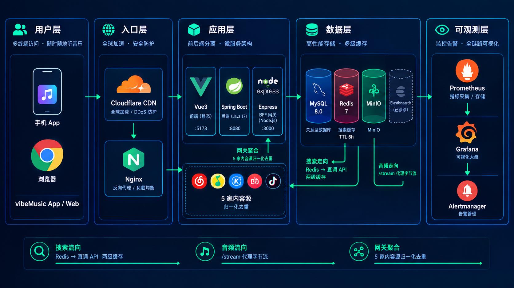
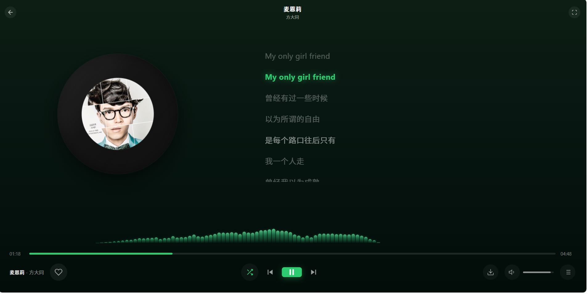
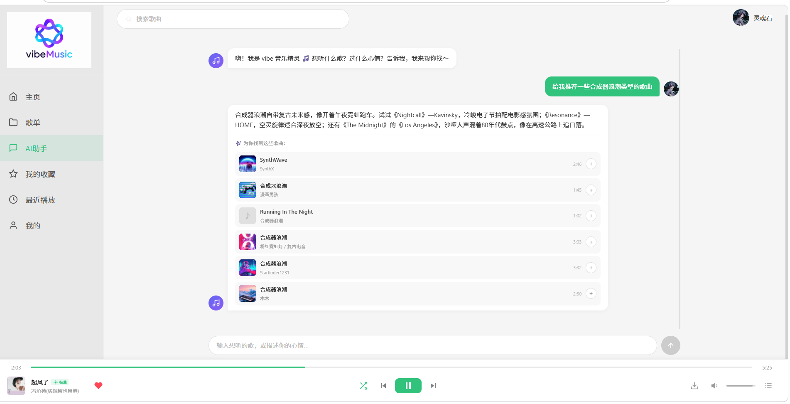
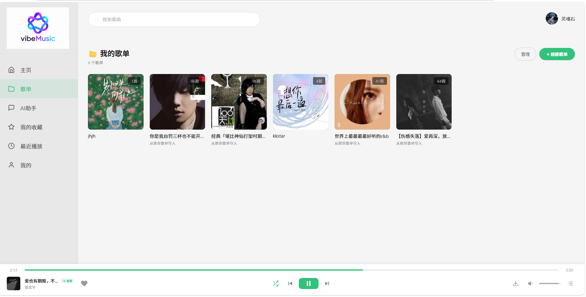
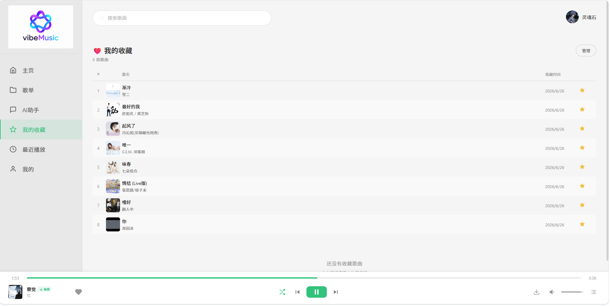
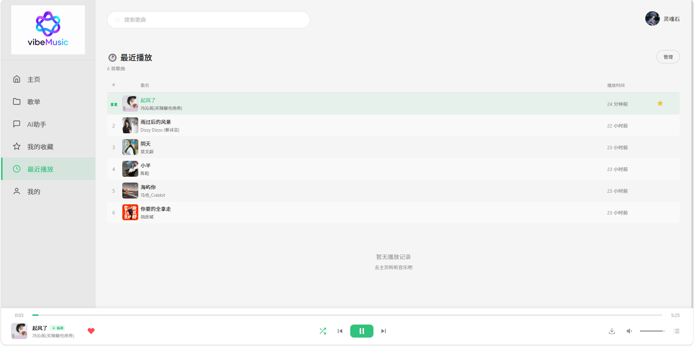
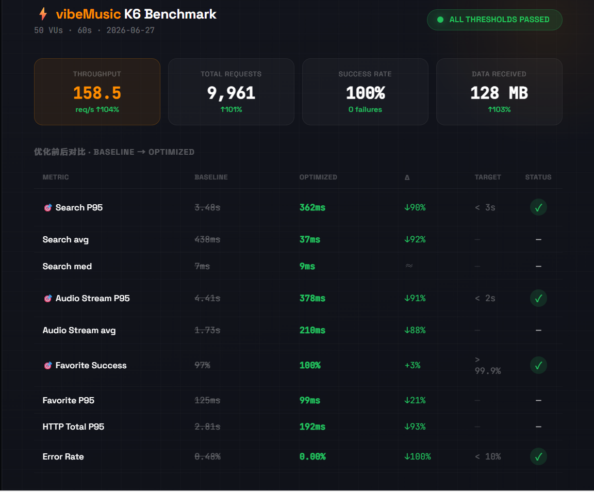
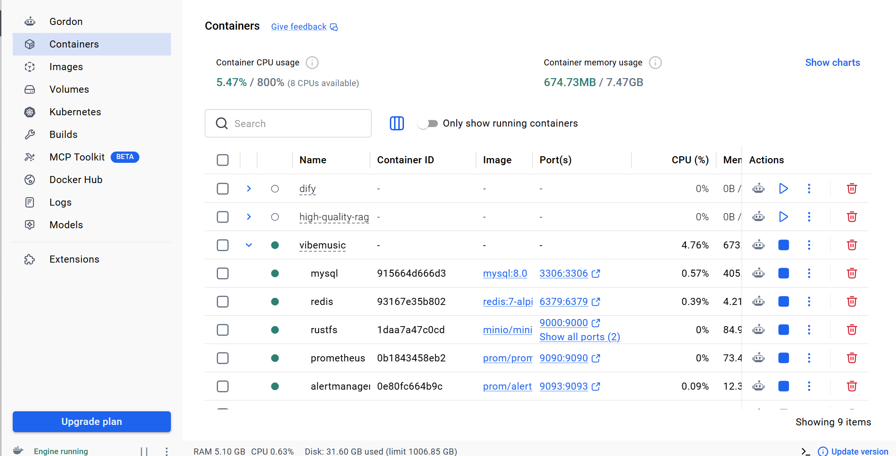
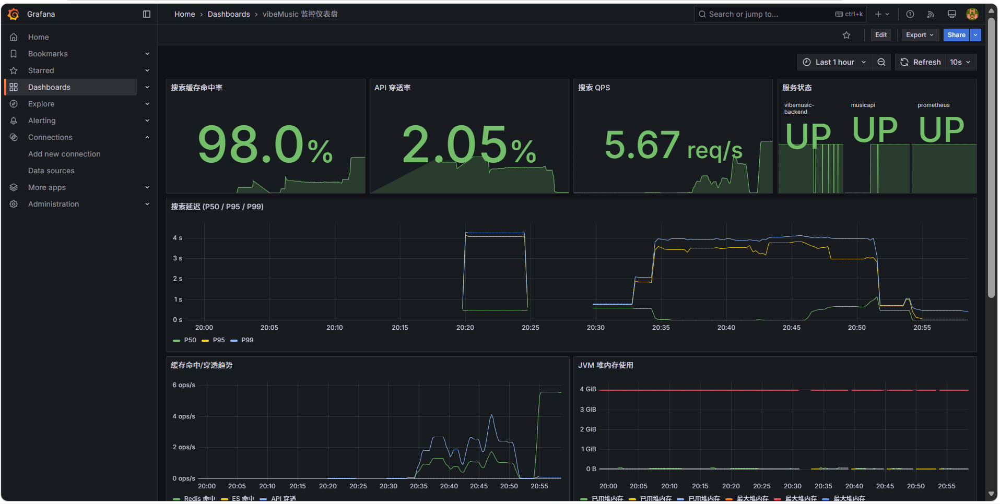

<h1>
  
  vibeMusic
</h1>

> 独立开发的全栈音乐平台 — 五源聚合搜索、AI Function Calling Agent、Redis 两级缓存、Docker 12 服务编排、Prometheus 可观测性。

<p align="center">
  <a href="https://vibe.cyk666.top"></a>
  <a href="https://github.com/chunren1/vibeMusic/actions/workflows/test.yml"></a>
  <a href="https://github.com/chunren1/vibeMusic"></a>
  <a href="https://adoptium.net/"></a>
  <a href="https://vuejs.org/"></a>
  <a href="https://www.docker.com/"></a>
</p>

---

## 📊 量化指标

| 🚀 指标 | 数值 | 🚀 指标 | 数值 |
|--------|:----:|--------|:----:|
| 全栈测试 | **703 条** | Docker 服务 | **12 个** |
| 代码覆盖率 | **60%+ 门禁** | 缓存策略 | **Redis 两级缓存** |
| 音源聚合 | **五源聚合** | 测试构成 | **后端 415 · 网关 121 · 前端 167** |
| AI 助手 | **流式输出** | API 端点 | **45 个** |

---

## 🎯 设计理念

市面上的音乐播放器项目大多停留在 CRUD 和播放功能。本项目希望**完整模拟互联网音乐平台的后台架构**，因此加入了：

- **多源聚合搜索**：多家音乐内容源统一归一化（曲名 / 艺人 / 封面 / 时长 / 播放地址），指纹去重 + 相关性 / 可播性多因子排序，单源故障自动降级不影响整体可用性
- **AI Agent**：基于 LLM Function Calling 实现自然语言操控音乐系统
- **缓存**：Redis（TTL 6h）→ 直调 API 两级链路，保障搜索 SLA
- **BYOC（用户自带凭证）**：多租户凭证隔离架构——用户级密钥 AES-GCM 加密存储、请求级透传、缓存级隔离（个人结果永不落入共享缓存），附带过期检测与重绑引导
- **监控可观测**：Micrometer + Prometheus + Grafana，追踪 JVM/缓存/延迟
- **全栈 DevOps**：12 服务 Docker 编排 + GitHub Actions CI/CD + 703 条测试（后端 415 · 网关 121 · 前端 167）

---

## 🏗️ 架构

<p align="center">
  
</p>

> 用户 → Nginx → Vue 前端 / Spring Boot 后端 / Express BFF → MySQL / Redis / MinIO → Prometheus → Grafana

---

## 🚀 快速开始

```bash
# 开发模式（musicapi 网关 + Web 前端；Java 后端另起：cd vibeMusic-backend && mvn spring-boot:run）
git clone https://github.com/chunren1/vibeMusic.git
npm run install:all
npm run dev

# Docker 全栈部署
npm run build
docker compose up -d
```

| 服务 | 地址 |
|------|------|
| Web | http://localhost |
| API 文档 | http://localhost:8080/swagger-ui.html |
| Grafana | http://localhost:3001 |

---

## 🔍 功能

**多源聚合（高可用设计）** — 统一归一化 + 指纹去重 + 多因子排序；任一上游抖动或故障时自动降级，其余源正常服务，搜索成功率不受单点影响。

**AI Function Calling** — LLM 自主决定搜索关键词并调用 `search_songs` / `get_user_history` 工具，SSE 流式输出，自然语言操控音乐系统。

**服务端自动降级播放** — 缓存命中直出，其余按可用性逐级降级保障可播性（客户端暂无音质选择器，音质由服务端自动决定）。

**BYOC 多租户凭证隔离** — 用户级密钥加密存储、请求级透传、缓存级隔离的三层隔离设计：个人权益归属个人，共享缓存零污染，过期自动引导重绑。

**个性化推荐 v3** — 随机种子 + 歌手兴趣扩展 + Redis 缓存（30 分钟刷新）+ 播放可用性批量标记（一次 DB 查询代替逐首远程探测）。

---

## 📸 页面展示

<table>
  <tr>
    <td width="33%" align="center"></td>
    <td width="33%" align="center"></td>
    <td width="33%" align="center"></td>
  </tr>
  <tr>
    <td width="33%" align="center"></td>
    <td width="33%" align="center"></td>
    <td width="33%" align="center"></td>
  </tr>
</table>

---

## 📊 性能

> **K6 压测** — 多虚拟用户并发 × 9,961 请求 · 0 错误 · 全部达标 ✅（历史压测结论，具体数值以重新压测为准）

<p align="center">
  
</p>

| 指标 | 基线 | 优化后 | 变化 |
|------|:---:|:-----:|:----:|
| 搜索 P95 | 基线较高 | **缓存命中时显著降低** | 缓存加速 |
| 音频流 P95 | 基线较高 | **并行探测 + 逐级降级** | 可播性优先 |
| 收藏成功率 | 偶发失败 | **重试后稳定成功** | 幂等守卫 |
| 吞吐量 | 基线 | **缓存命中时显著提升** | 缓存加速 |

---

## 🐳 运维监控

<table>
  <tr>
    <td width="50%" align="center">
      <strong>14 服务编排</strong><br/>
      
    </td>
    <td width="50%" align="center">
      <strong>Grafana 监控面板</strong><br/>
      
    </td>
  </tr>
</table>

**12 服务**：Nginx · Spring Boot · Express BFF · MySQL 8.0 · Redis 7 · MinIO · Prometheus · Grafana · MinIO Init · MySQL Backup · Redis Exporter · MinIO Backup

**监控链路**：Micrometer 埋点 → Prometheus 采集 → Grafana 可视化（告警规则在 Prometheus/Grafana 界面可见）

---

## 🔭 Observability & Hardening

### 环境变量一览

| 变量 | 说明 | 默认值 | 来源 |
|------|------|--------|------|
| `DB_POOL_MAX_SIZE` | Hikari 最大连接数 | `10`（compose 设为 `20`） | `application.yml` → `hikari.maximum-pool-size` |
| `DB_POOL_MIN_IDLE` | Hikari 最小空闲连接 | `2`（compose 设为 `5`） | 同上 `minimum-idle` |
| `DEPLOYMENT_ENV` / `SPRING_PROFILES_ACTIVE` | 部署环境 (`docker`/`prod`/`dev`) | `docker` | compose / `.env` |
| `threadpool.searchCore` | 搜索线程池 core | `20` | `ThreadPoolConfig` `@ConfigurationProperties(prefix="threadpool")` |
| `threadpool.searchMax` | 搜索线程池 max | `40` | 同上 |
| `threadpool.searchQueue` | 搜索线程池队列容量 | `100` | 同上 |
| `threadpool.searchKeepAlive` | 搜索线程池 keepAlive (秒) | `60` | 同上 |
| `threadpool.warmCore/warmMax/warmQueue` | 预热线程池 | `1/1/20` | 同上 |
| `threadpool.getUrlCore/getUrlMax/getUrlQueue` | 取播放链接线程池 | `3/3/10` | 同上 |

> OpenTelemetry 相关变量（`OTEL_*`）当前**未启用**（主栈无 otel-collector 服务、Dockerfile 未挂 javaagent），仅在 `.env.example` 中作为接入预留，详见下文。

> Hikari 额外硬化：`pool-name=vibeMusic-HikariCP`、`auto-commit=false`、`leak-detection-threshold=10s`、`register-mbeans=true`、`connection-timeout=5s / max-lifetime=10m / idle-timeout=5m`。
> JVM 硬化（`JAVA_OPTS`，由 Dockerfile `sh -c exec java $JAVA_OPTS` 展开）：`-XX:MaxDirectMemorySize=128m -XX:MetaspaceSize=64m -XX:MaxMetaspaceSize=128m -XX:MaxRAMPercentage=75.0 -XX:MinRAMPercentage=50.0 -XX:+UseG1GC`。

示例（覆盖默认值）：

```bash
# .env
DB_POOL_MAX_SIZE=20
DB_POOL_MIN_IDLE=5
DEPLOYMENT_ENV=docker
PROJECT_VERSION=1.2.0
CORS_ORIGINS=https://vibe.cyk666.top
```

`threadpool.*` 通过 `application.yml` / 环境变量覆盖（Spring relaxed binding，点号可用下划线）：

```properties
# application-docker.yml 或环境变量
threadpool.searchCore=50
threadpool.searchMax=100
threadpool.searchQueue=300
threadpool.searchKeepAlive=60
# 或 env: THREADPOOL_SEARCHCORE=50
```

### OpenTelemetry 链路追踪（未接入，可选扩展）

> 当前状态：主栈未部署 `otel-collector`、Dockerfile 未挂 `-javaagent`，因此**没有 traces 数据**；
> `docker-data/otel-collector-config.yaml`、`docker-data/download-otel-javaagent.sh` 与 `.env.example`
> 中的 `OTEL_*` 变量作为接入预留保留。以下步骤供需要时开启（不要在 README 假设已生效）：

```bash
# 1. 下载 Java Agent（首次 / 升级版本；也可用本机留存的 docker-data/download-otel-javaagent.sh）
mkdir -p docker-data/otel-javaagent && cd docker-data/otel-javaagent
curl -fLO https://github.com/open-telemetry/opentelemetry-java-instrumentation/releases/download/v2.6.0/opentelemetry-javaagent-2.6.0.jar
ln -sf opentelemetry-javaagent-2.6.0.jar opentelemetry-javaagent.jar && cd ../..
# 产物：docker-data/otel-javaagent/opentelemetry-javaagent.jar （已 gitignore）

# 2. 在 docker-compose.yml 增加 otel-collector 服务（配置样例见 docker-data/otel-collector-config.yaml），
#    并给 backend 挂载 ./docker-data/otel-javaagent:/otel-javaagent:ro
#    在 JAVA_OPTS 追加 -javaagent:/otel-javaagent/opentelemetry-javaagent.jar
#    （Dockerfile 已改为 sh -c exec java $JAVA_OPTS，可直接生效）

# 3. 验证
docker compose logs otel-collector | tail -n 50
```

Collector 配置样例：`otlp:4317/4318` → `memory_limiter` → `batch` → `resource` → `tail_sampling` → `prometheus` + `logging`。
CI 中的 infra-lint job 会对该 YAML 做语法与 `tail_sampling` 策略校验，保证样例不腐化。

### 告警规则（19 条，按实际抓取指标校准）

> 源文件：`docker-data/prometheus/alert-rules.yml`（Prometheus `rule_files` 引用，经 `promtool check rules` 校验）
> 说明：仅保留主栈实际抓取到的指标（backend/musicapi/prometheus/redis 四个 job）；
> 依赖 node-exporter/cAdvisor 的磁盘与容器类规则已移除（未部署对应 exporter，保留会永不触发）。

| 组 | 数量 | 告警 | 触发条件 |
|----|------|------|----------|
| `service-alerts` | 3 | `BackendDown` / `MusicApiDown` / `PrometheusDown` | `up{job=...}==0` 超 1m |
| `infrastructure-alerts` | 1 | `HighFdUsage` | 文件描述符 >80% (5m) |
| `jvm-alerts` | 5 | `HighJvmMemoryUsage` / `HighJvmNonHeapMemoryUsage` / `HighGcFrequency` / `LongOldGcDuration` / `HighThreadCount` | 堆 >85% / 非堆 >400MB / GC >10/s / OldGC 单次 >1s / 线程 >500 |
| `datasource-alerts` | 3 | `HikariPoolUsageHigh` / `HikariPoolAcquireSlow` / `HikariPoolLeakDetected` | 活跃 >85% / 单次获取 >1s / pending >0 持续 3m |
| `cache-alerts` | 2 | `LowCacheHitRate` / `RedisDown` | 穿透 >70% (10m) / `up{job="redis"}==0` |
| `business-sla-alerts` + `performance-alerts` | 5 | `SearchSuccessRateLow` / `PlayFailureRateHigh` / `LoginFailureRateHigh` / `ApiAvgLatencyHigh` / `HighSearchLatency` | 搜索成功率 <99% / 播放 5xx >1% / 登录 4xx >5% / API 均值 >2s / 搜索 P95 >1s |

通知：Alertmanager 为空壳 receiver（从不投递）已移除；当前告警仅在 Prometheus/Grafana 界面可见，需要触达可复用 `scripts/ops/cookie-monitor.py` 的 Server酱通道或自建 webhook。

### 线程池调优指南

`ThreadPoolConfig` (`@Configuration(prefix="threadpool")`) 统一托管 4 个 `ThreadPoolTaskExecutor`，避免 static 泄漏，Spring 管理生命周期。

| 池 | core / max / queue / keepAlive | 拒绝策略 | 用途 |
|----|-------------------------------|----------|------|
| `searchExecutor` | **50 / 100 / 300 / 60s** | `AbortPolicy`（fail-fast，队列满直接 503） | 搜索五源聚合 |
| `warmExecutor` | 1 / 1 / 20 / 60s | `DiscardOldestPolicy` | 热门词预热 |
| `getUrlExecutor` | 3 / 3 / 10 / 60s | `AbortPolicy`（默认） | 音频 URL 探测 |
| `asyncCacheExecutor` | 2 / 4 / 20 / 30s | `DiscardPolicy` | 异步缓存清理 |

**为何 search 用 `AbortPolicy` fail-fast 而非静默丢弃**：搜索过载时直接返回 503，让调用方立刻感知背压并触发告警（`SearchThreadPoolRejected` / `SearchThreadPoolQueueBacklog`），比静默丢最旧任务更易定位问题。`warm/asyncCache` 为可丢弃任务保留丢弃策略；`getUrl` 为关键路径保留默认策略以暴露背压。

调优建议：先压测 `search.latency P95 / executor.queue.size / executor.active`（`management.metrics.distribution` 已开启 histogram），队列持续 >100 再考虑扩 `searchMax`/`searchQueue`，而非盲目调大 core。

> Nginx 加固：`set_real_ip_from 172.16.0.0/12 (+10.0.0.0/8)` + `real_ip_header X-Forwarded-For` + `real_ip_recursive on` + `limit_req_zone $binary_remote_addr` — 仅信任内网网段的 `XFF`，以 `binary_remote_addr` 限流防 Header 伪造。

### 备份可靠性（flock / trap / sha256）

`mysql-backup` / `minio-backup` 均为 `restart: unless-stopped` 的常驻容器，循环 `sleep 86400 & wait $!`，`trap SIGTERM/SIGINT` 优雅退出，`flock -w 3600 /backup/.backup.lock` 互斥防并发：

- **MySQL**：`mysqldump --single-transaction --routines --triggers | gzip > /backup/vibemusic-YYYYMMDD-HHMMSS.sql.gz` → `sha256sum … > …sha256` → `find … -mtime +30 -delete`（含 sha256）。
- **MinIO**：`mc mirror --overwrite minio/vibemusic /backup/vibemusic` → `find … -type f -exec sha256sum {} + > /backup/vibemusic-YYYYMMDD-HHMMSS.sha256`。
- 宿主机卷：`./docker-data/backups/{mysql,minio}:/backup`。

---

## 🧪 测试

```text
703 条自动化测试
├── 后端 415 条 (JUnit 5 + Mockito + H2)
│   └── Service · Controller · JWT · 幂等守卫 · 限流
├── 网关 121 条 (musicapi Express BFF)
│   └── 聚合搜索 · Cookie · 降级链路
├── 前端 167 条 (Vitest + jsdom)
│   └── PlayerStore · AuthStore · FavoriteStore · 视图交互
└── CI/CD (GitHub Actions)
    └── push / PR → 全量测试 → JaCoCo 60% 覆盖率门禁
```

---

## 🛡️ 技术栈

<p align="center">
  
  
  
  
  
  
  <br/>
  
  
  
  
  
</p>

---

## 🗺️ 路线图

| 阶段 | 内容 |
|------|------|
| ✅ **v1** | 用户认证 · 搜索播放 · 收藏歌单 · 歌词 |
| ✅ **v2** | AI 助手 · 双源聚合 · 推荐引擎 · 歌单导入 |
| ✅ **v3** | 缓存降级 · 幂等守卫 · 限流 · 连接池 |
| ✅ **v4** | 654 测试（后端 392 · 网关 105 · 前端 157）· JaCoCo 60% · GitHub CI |
| ✅ **v5** | Docker 14 服务 · Prometheus · Grafana · 告警 |
| ✅ **v6** | K6 压测达标 · 音频并行降级 · 收藏重试 |
| ⬜ **v7** | Kubernetes 部署 · ArgoCD · OpenTelemetry（未建设） |
| ✅ **v8** | 多源聚合搜索（统一归一化 / 指纹去重 / 故障自动降级）· 缓存架构简化为 Redis 两级 |
| ✅ **v9** | BYOC 多租户凭证隔离（用户级密钥加密存储 / 请求级透传 / 缓存级隔离 / 过期重绑） |

---

## 📖 API

启动后端后访问 [http://localhost:8080/swagger-ui.html](http://localhost:8080/swagger-ui.html) 在线测试。

端点示例：`/api/songs/search` · `/api/songs/stream` · `/api/assistant/chat` · `/api/favorites/toggle`

---

## 📄 开源协议

MIT © [chunren1](https://github.com/chunren1)
